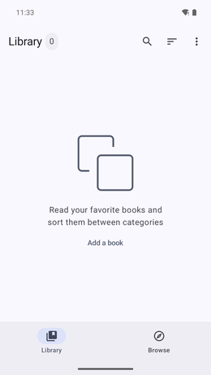
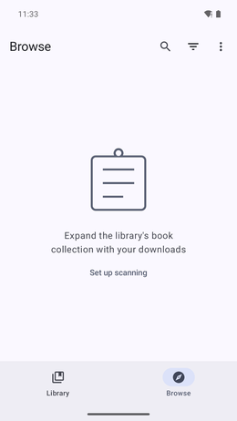

# ePub Magazine Reader

Reads the day's newspapers and magazines delivered as EPUB — by Calibre's news recipes or a
generator of your own. An issue opens as a contents page, one card per article by section,
then each article on its own page, with previous / contents / next always on top. Pages, not
scrolling: made for e-ink. Ordinary books open as in
[Book's Story](https://github.com/Acclorite/book-story), which it forks.

## Key points

* An EPUB whose layout is an issue (title page, contents, one chapter per article) opens in
  magazine mode by itself; any other EPUB opens as an ordinary book.
* The contents are paginated to the screen: category, title and, when the issue has one, the
  article's picture. Tap a card to read; the header goes to the previous article, the
  contents, the next.
* New issues can be fetched from a WebDAV folder (kDrive, Nextcloud…): settings → sync. Files
  already on the phone are skipped.
* Everything else — library, fonts, themes, tap zones — is Book's Story's.
* It installs beside Book's Story under its own id, `com.freedomfighter.magazinereader`
  (builds before 0.2.24 used another id and must be uninstalled by hand).

How the issues are recognised and laid out: [MAGAZINE-READER-phases-1-2.md](MAGAZINE-READER-phases-1-2.md).

## Install

From the [F-Droid repo](https://funkypitt.github.io/fdroid-repo/).

## Build

`./gradlew assembleRelease` (JDK 17+, Android SDK).

## Screenshots

 

## Crédits / Credits

Basé sur / Based on [Book's Story](https://github.com/Acclorite/book-story) by Acclorite, GPL-3.0-only. Voir / see `NOTICE.md`.

© 2026 Pierre Gallaz. Développé avec [Claude Code](https://claude.com/claude-code) (Anthropic).
Licence GPL-3.0, voir `LICENSE`.

© 2026 Pierre Gallaz. Developed with [Claude Code](https://claude.com/claude-code) (Anthropic).
GPL-3.0 licence, see `LICENSE`.
